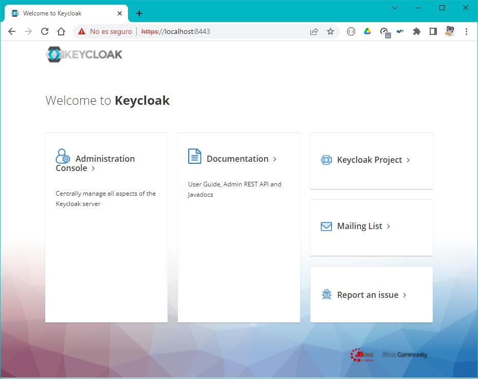

# X.509 client authentication

To enable X.509 client authentication in the KC auth server, follow the next steps:

## Setting up the configuration file

This configuration should be applied before running KC through the `${kc.home.dir}/conf/keycloak.conf` properties file:

### Setting server certificate

In order to enable HTTPS connections you have to set a keypair in the server side: 

```properties
# Path to keystore file (containing a SSL Server certificate signed with CA certificate)
https-key-store-file=${kc.home.dir}/conf/server.jks

# Keystore password
https-key-store-password=*****
```

> Keystore and server certificate password have to be the same.

> Keystore password is in plain text, so it's a good idea to store it in a [vault](https://github.com/keycloak/keycloak-community/blob/main/design/secure-credentials-store.md).

### Enabling mutual TLS (mTLS)

KC also need a truststore to store certificates to verify clients that are communicating with KC, required to enable X.509 client authentication:

```properties
# Enabling mutual TLS
https-client-auth=request

# Path to trust-store file (containing the CA certificate)
https-trust-store-file=${kc.home.dir}/conf/softquadrat.jks

# Trust-store password (is in plain text, so it's a good idea to store it in a vault)
https-trust-store-password=*****
```

In our case, the truststore only contains the CA certificate, because it is the root of all the certificates that we want to consider as valid. It is also possible to add each and every one of the client certificates that we want to validate (e.g., if clients use self-signed certificates), but it's not what we want.

## Administrator console

After you made changes in the configuration file and run KC, then you have to manage it by accessing through a browser:



Then click on **Administration Console**:


Enter administrator credentials (these credentials are set the first time KC is run) and you will be logged in:


#### Create a realm

On the top-left corner, click on **Master > Add realm**:


Enter a name for the new realm (e.g.: `datasqill`, better in lowercase) and click on **Create**:


> It is possible to import all realm configuration from a JSON file with the **Import** option.


And now we have a new realm called `datasqill`. The default configuration in this tab is valid for our purposes. As you can see, by default our new realm supports OpenID Connect and SAML, despite we need only the first one.

#### Set private key for signing issued JWTs

Go to **Realm Settings > Keys**:


Click on **Providers** option under **Keys** tab, and choose `java-keystore"` on the **Add keystore...** dropdown list:


And then, fill the form as follows an click on **Save**:

 

- **Priority**: if there is more than one private key for signing tokens, it will choose the valid key that has the highest priority (e.g.: 200, to make it higher to KC's default private keys).

- **Algorithm**: alg. used when signing (e.g. RSA256)

- **Keystore**: full path to the JKS file.

- **Keystore Password**: password needed to open the keystore.

- **Key Alias**: alias of the key inside the keystore that we want to use for signing.

- **Key Password**: password of the key.

- **Key use**: "sig" for singing tokens ("enc" would be for encryption).

Then, we can see our new siging key active and in first position:


#### Setup token validity

To configure the validity time and when a token expires, we must go to **Realm Settings > Tokens** tab:


#### Create a client

Clients are the resource servers and we must configure at least one to be able to authenticate and authorize users:

Go to **Clients** section on the left panel and click on **Create** under **Lookup** tab:


Introduce a **Client ID** (e.g. `transformation`), which is needed when the user application request a token, set `openid-connect` as **Client Porotocol** (the alternative is `saml`), and finally click on **Save**:


Then, in **Settings** tab, you have to set at least one **Valid Redirect URI** using the auth server URL (e.g.), set **Access Type** to `confidential` and activate **Authorization Enabled** (this will automatically activate **Service Accounts Enabled**):


As we set our **Access Type** to `confidential`, then we must specify how is the user identified.

#### Setup the authentication flow for X.509 certificate authentication

Flows are sequences of steps to authenticate users in KC (or achieve any action related with authentication), and we can create our own custom flows. They can be applied to different user interactions with KC (connecting via a web browser, resetting credentials, direct access to its REST API, ...).

We want that our **users can be authenticated using their X.509 certificates**, so, let's create a new flow for this.

Inside our **Realm**, click on **Authentication** on the left panel, and click on **New** to create a new flow from scratch:


Set an **Alias** for the new flow (e.g. `X509`) and click on **Save**:


Then click on **Add execution**:


As a **Provider** we must choose `X509/Validate Username` in the dropdown list, and click on **Save** again:


After creating the flow execution, we have to configure it expanding **Actions** and choosing **Config**:


As mutual TLS is enabled, KC server got the user's certificate when the connection with the client is established. If the connection was established, it means that the user has a valid certificate (it was trusted with the CA certificate which is stored in the previously configured truststore).

So, now, we have to specify how to extract the user identity from this certificate.

In our case, we want to extract the user ID from the SubjectDN using a regular expression, so we choose `Match SubjectDN using a regular expression` in **User Identity Source**, set `UID=(.*?)(?:$)` as regular expression (in a reg.exp., parenthesis defines groups, and they are used to specify which part of the Subject DN will be extracted), and finally, in **User Mapping Method** we set `Username or Email`, in order to use these fields to find the user in the users database (so, the extracted data from the Subject DN must match with the username or email of any user in the KC users database). Finally, click **Save** at the bottom of the form.


Now, we have to use our new custom flow to enable direct grant access to the KC server, so valid users can request access tokens to KC through its REST API. So, go to **Authentication > Bindings** and choose `X509` as **Direct Grant Flow**, and don't forgot to click on **Save**:


That's all!

Remember that your users have to exist in the KC user database or in any of the federated (Active Directory, LDAP) or custom (Service Provider Interface module) user identitify providers.

# References

- [Adding X.509 client certificate authentication to a Direct Grant Flow](https://www.keycloak.org/docs/latest/server_admin/#adding-x-509-client-certificate-authentication-to-a-direct-grant-flow)

- [Configuring TLS](https://www.keycloak.org/server/enabletls)

- [Keycloak with HTTPS & mutual TLS / X.509 authentication | Niko Köbler (@dasniko)](https://www.youtube.com/watch?v=yq1hzNs1JQU)
